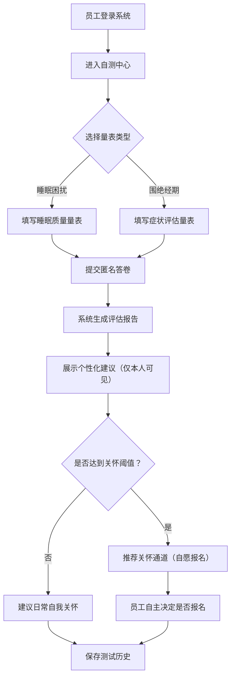
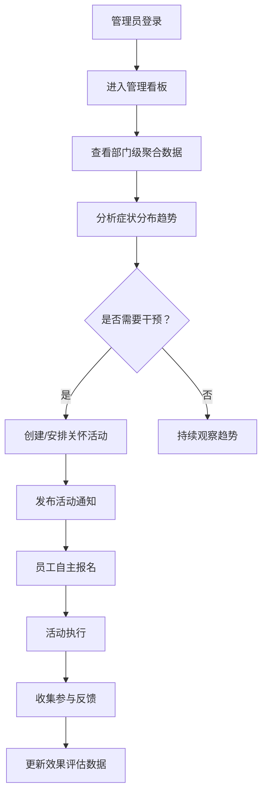

## 1. 产品概述

「悦享·她健康」是一款面向企业女员工的健康关怀内部福利工具，专注于为围绝经期（更年期）女性员工提供失眠支持和综合健康管理。产品通过匿名自测、数据洞察和个性化关怀，帮助人力资源和工会从传统的"发福利"模式，转向"做得上手、看得见效果"的主动健康支持体系。

- **核心目标**：保护员工隐私的前提下，提供科学的睡眠和围绝经期健康支持，降低相关症状对工作效率和生活质量的影响
- **目标用户**：企业女员工（使用者）、人力资源部/工会（管理者）
- **市场价值**：填补企业女性员工围绝经期健康关怀的市场空白，助力企业打造有温度的员工福利体系

## 2. 核心功能

### 2.1 用户角色

| 角色 | 登录方式 | 核心权限 |
|------|----------|----------|
| 普通员工 | 企业SSO/工号登录 | 完成匿名自测、查看个人建议、报名活动、浏览资源、提交反馈、自愿报名关怀通道 |
| HR/工会管理员 | 管理员权限登录 | 查看部门级匿名统计趋势、管理关怀计划、发布活动、审核反馈、配置资源、管理关怀通道 |

### 2.2 功能模块

1. **首页仪表盘**：健康问候、快捷入口、每日放松练习、睡眠卫生提示、个人数据概览
2. **员工自测中心**：睡眠困扰筛查量表、围绝经期症状评估、测试历史记录、个性化建议报告
3. **关怀计划推送**：短时放松练习、周末调息建议、办公室睡眠卫生清单、个性化提醒
4. **活动报名中心**：睡眠讲座、压力管理课程、午休优化工作坊、健康咨询窗口预约
5. **资源中心**：睡眠科普文章、围绝经期健康指南、放松音频、专家问答库
6. **关怀通道**：高频夜醒人群关怀、明显疲劳人群支持、长期焦虑心理咨询、自愿报名机制
7. **反馈收集**：匿名满意度调查、功能建议、体验反馈
8. **管理看板**：部门趋势分析、症状热度图、活动参与统计、关怀效果评估

### 2.3 页面详情

| 页面名称 | 模块名称 | 功能描述 |
|----------|----------|----------|
| 首页仪表盘 | 健康问候卡 | 根据时间和个人状态显示温暖问候语 |
| 首页仪表盘 | 快捷功能入口 | 一键进入自测、活动、资源等核心功能 |
| 首页仪表盘 | 每日放松练习 | 展示今日推荐的3-5分钟呼吸/冥想练习 |
| 首页仪表盘 | 睡眠提示轮播 | 办公室可执行的睡眠卫生小贴士 |
| 首页仪表盘 | 个人数据概览 | 自测趋势图、建议完成度、活动报名状态（仅本人可见） |
| 自测中心 | 量表选择 | 睡眠困扰/围绝经期症状两套专业量表 |
| 自测中心 | 答题界面 | 分步答题、进度指示、匿名标识提醒 |
| 自测中心 | 结果报告 | 个人专属建议、严重程度标识、就医提醒阈值 |
| 自测中心 | 历史记录 | 历次测试结果趋势对比 |
| 关怀计划 | 放松练习库 | 分类呼吸练习、身体扫描、正念冥想内容 |
| 关怀计划 | 周末调息 | 周末专属的放松建议和活动推荐 |
| 关怀计划 | 睡眠清单 | 办公室场景、居家场景的睡眠卫生检查清单 |
| 活动中心 | 活动列表 | 按类型/时间筛选的活动卡片列表 |
| 活动中心 | 活动详情 | 活动介绍、时间地点、讲师信息、名额状态 |
| 活动中心 | 我的报名 | 已报名活动列表、取消报名功能 |
| 资源中心 | 文章分类 | 睡眠知识、激素变化、情绪管理、营养运动 |
| 资源中心 | 媒体资源 | 放松音频播放、视频教程嵌入 |
| 资源中心 | 专家问答 | 常见问题解答、专家答疑记录 |
| 关怀通道 | 人群识别 | 根据自测结果自动匹配适合的关怀项目 |
| 关怀通道 | 自愿报名 | 说明介绍、隐私承诺、报名表单 |
| 关怀通道 | 进度跟踪 | 关怀服务预约状态、服务记录 |
| 反馈中心 | 反馈表单 | 多维度满意度评价、文字建议 |
| 反馈中心 | 反馈记录 | 历史反馈及处理状态 |
| 管理看板 | 数据总览 | 参与率、症状分布Top5、活动数据摘要 |
| 管理看板 | 部门趋势 | 各部门匿名聚合数据对比、时间趋势图 |
| 管理看板 | 活动管理 | 发布/编辑活动、查看报名数据、导出名单 |
| 管理看板 | 反馈审阅 | 查看匿名反馈、标记处理状态 |

## 3. 核心流程

### 3.1 员工自测与建议流程

员工登录后进入自测中心，选择睡眠或围绝经期量表，匿名完成全部题目后，系统生成仅个人可见的评估报告和个性化建议。若结果达到关怀阈值，系统自动推荐对应的关怀通道供员工自愿选择。

### 3.2 管理看板数据分析流程

管理员登录管理看板，查看按部门聚合的匿名统计数据（不含任何个人标识），识别高需求部门和症状趋势，据此安排针对性活动或资源投放，并跟踪活动效果。

## 4. 用户界面设计

### 4.1 设计风格

**整体调性**：温暖、柔和、专业、信赖感。采用「疗愈系自然美学」风格，以柔和的暖色调为主，配合自然元素，营造安全、舒适、被关怀的情感体验。

- **主色调**：玫瑰粉（#E8B4B8）作为主品牌色，传递温柔关怀
- **辅助色**：薰衣草紫（#C9B1D4）代表舒缓放松；鼠尾草绿（#A8C3A0）代表自然健康
- **中性色**：暖米白（#FAF7F2）背景、暖灰（#8A8178）文字、深棕（#5C4B42）标题
- **强调色**：落日橙（#F2B880）用于关键CTA和数据高亮
- **按钮风格**：圆角胶囊形按钮，渐变填充，悬停微动效，点击有柔和阴影变化
- **字体**：标题使用「思源宋体」体现专业温度，正文使用「思源黑体」保证可读性
- **布局风格**：卡片式布局，大圆角（16-24px），充足留白，柔和阴影，不对称网格增加呼吸感
- **图标风格**：线性圆角图标，配合柔和渐变填充点缀，使用自然元素（叶子、月亮、花朵）
- **装饰元素**：柔和渐变光斑、细微噪点纹理、有机曲线分隔、淡色水彩晕染背景

### 4.2 页面设计概览

| 页面名称 | 模块名称 | UI元素 |
|----------|----------|--------|
| 首页仪表盘 | 健康问候卡 | 渐变背景卡片、动态问候语、天气/时间关联插图 |
| 首页仪表盘 | 快捷入口 | 4个彩色图标卡片、悬停浮起动效、渐变图标背景 |
| 首页仪表盘 | 每日练习 | 播放按钮卡片、进度圆环、呼吸引导动画 |
| 首页仪表盘 | 趋势概览 | 迷你折线图、柔和彩色区域填充、数据卡片 |
| 自测中心 | 量表选择 | 左右分屏对比卡片、图标+描述、选中高亮动画 |
| 自测中心 | 答题界面 | 顶部进度条、大字号题目、单选卡片选项、平滑过渡 |
| 自测中心 | 结果报告 | 数据仪表盘、严重程度色阶、建议列表卡片 |
| 活动中心 | 活动卡片 | 封面图占位、标签徽章、时间轴图标、名额进度条 |
| 资源中心 | 分类导航 | 横向滚动标签栏、选中态下划线渐变 |
| 资源中心 | 文章列表 | 图文卡片、阅读时间标签、分类彩色标记 |
| 管理看板 | 数据总览 | 4个KPI数字卡片、趋势箭头、彩色背景块 |
| 管理看板 | 趋势图表 | 多色折线图、部门对照柱状图、热力图 |

### 4.3 响应式设计

- **设计原则**：桌面端优先（内部系统主要在PC端使用），同时适配平板和移动端
- **断点设置**：1280px（桌面标准）、1024px（平板横屏）、768px（平板竖屏）、480px（手机）
- **移动端适配**：侧边栏折叠为底部Tab导航、卡片堆叠为单列、图表自适应缩放、触控区域放大至44px以上
- **触摸优化**：关键按钮增加点击反馈动效，支持下拉刷新、横向滑动切换分类

### 4.4 动效与交互体验

- **页面加载**：卡片依次淡入上浮（staggered reveal，100ms间隔）
- **导航切换**：内容区域平滑淡入淡出，左侧激活指示器滑动动画
- **数据可视化**：图表数据从0到目标值的渐进填充动画（1.2s ease-out）
- **按钮交互**：悬停时轻微放大+阴影加深，点击时按压反馈
- **呼吸练习引导**：圆形缩放动画配合呼吸节奏（4秒吸-4秒呼循环）
