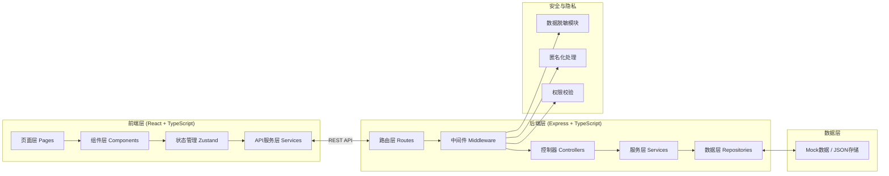
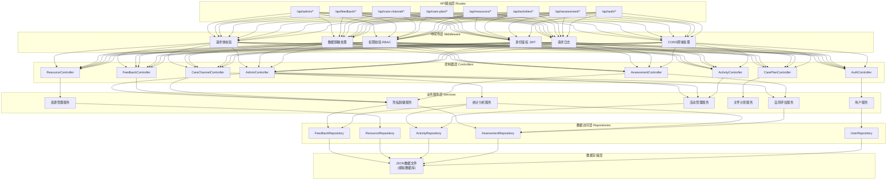
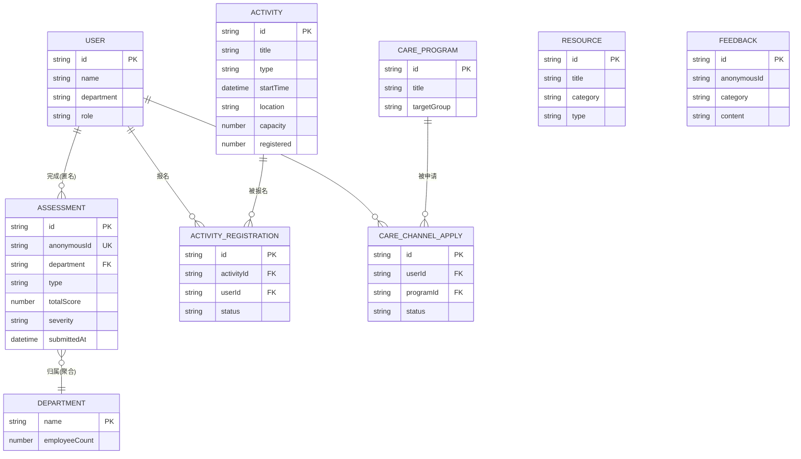

## 1. 架构设计

本项目采用前后端分离的全栈架构，前端使用React负责界面展示与交互，后端使用Express提供RESTful API服务，数据存储使用本地JSON文件模拟（便于演示），所有自测数据严格按部门聚合脱敏处理，确保员工隐私安全。



## 2. 技术描述

- **前端框架**：React@18 + TypeScript@5，采用函数组件 + Hooks 开发模式
- **构建工具**：Vite@5，提供极速热更新和构建性能
- **UI样式**：TailwindCSS@3，配合自定义主题配置实现疗愈系设计
- **状态管理**：Zustand@4，轻量级状态管理，管理用户、自测、活动等状态
- **路由管理**：React Router Dom@6，实现SPA多页面路由
- **图表可视化**：Recharts@2，React生态图表库，支持折线图、柱状图、热力图
- **图标库**：Lucide React，统一的线性图标风格
- **后端框架**：Express@4 + TypeScript，RESTful API服务
- **跨域处理**：CORS中间件
- **数据存储**：本地JSON文件（演示用），可无缝切换至PostgreSQL
- **初始化工具**：vite-init（react-express-ts模板）

## 3. 路由定义

### 3.1 前端路由（员工端）

| 路由路径 | 页面名称 | 用途 |
|----------|----------|------|
| / | 首页仪表盘 | 健康问候、快捷入口、每日练习、数据概览 |
| /assessment | 自测中心 | 量表选择、答题、结果报告、历史记录 |
| /assessment/sleep | 睡眠自测 | 睡眠困扰量表答题页 |
| /assessment/menopause | 症状自测 | 围绝经期症状量表答题页 |
| /assessment/result/:id | 自测报告 | 个人评估结果与建议详情 |
| /care-plan | 关怀计划 | 放松练习、周末调息、睡眠卫生清单 |
| /activities | 活动中心 | 活动列表、筛选、详情 |
| /activities/:id | 活动详情 | 活动信息、报名操作 |
| /activities/my | 我的活动 | 已报名活动管理 |
| /resources | 资源中心 | 文章、音频、视频、问答 |
| /resources/:id | 资源详情 | 文章/音频播放页面 |
| /care-channel | 关怀通道 | 关怀项目介绍、自愿报名 |
| /feedback | 反馈中心 | 反馈提交、历史记录 |
| /profile | 个人中心 | 基本信息、隐私设置 |

### 3.2 前端路由（管理端）

| 路由路径 | 页面名称 | 用途 |
|----------|----------|------|
| /admin | 管理看板首页 | 数据总览、KPI卡片 |
| /admin/dashboard | 数据看板 | 部门趋势、症状分布、图表分析 |
| /admin/activities | 活动管理 | 创建/编辑活动、报名管理 |
| /admin/feedback | 反馈管理 | 匿名反馈审阅、处理 |
| /admin/resources | 资源管理 | 文章/资源发布管理 |

### 3.3 后端API路由

| 路由路径 | 方法 | 用途 |
|----------|------|------|
| /api/auth/login | POST | 用户登录 |
| /api/assessment/sleep | POST | 提交睡眠自测答卷（匿名存储） |
| /api/assessment/menopause | POST | 提交围绝经期自测答卷（匿名存储） |
| /api/assessment/my | GET | 获取本人自测历史 |
| /api/assessment/result/:id | GET | 获取单份自测报告 |
| /api/admin/stats/overview | GET | 获取管理看板总览数据（聚合脱敏） |
| /api/admin/stats/department | GET | 获取部门级趋势数据（聚合脱敏） |
| /api/admin/stats/symptoms | GET | 获取症状分布统计（聚合脱敏） |
| /api/activities | GET | 获取活动列表 |
| /api/activities/:id | GET | 获取活动详情 |
| /api/activities/:id/register | POST | 活动报名 |
| /api/activities/my | GET | 我的报名列表 |
| /api/activities/:id/cancel | POST | 取消活动报名 |
| /api/admin/activities | POST | 创建活动 |
| /api/admin/activities/:id | PUT | 编辑活动 |
| /api/resources | GET | 获取资源列表 |
| /api/resources/:id | GET | 获取资源详情 |
| /api/care-plan/exercises | GET | 获取放松练习列表 |
| /api/care-plan/tips | GET | 获取睡眠卫生贴士 |
| /api/care-channel/programs | GET | 获取关怀项目列表 |
| /api/care-channel/apply | POST | 自愿报名关怀通道 |
| /api/feedback | POST | 提交反馈（匿名） |
| /api/admin/feedback | GET | 获取反馈列表（匿名） |

## 4. API数据类型定义

```typescript
// 共享类型定义

// 用户相关
interface User {
  id: string;
  name: string;
  department: string;
  role: 'employee' | 'admin';
  avatar?: string;
}

// 睡眠自测答卷
interface SleepAssessment {
  id: string;
  userId?: string;
  anonymousId: string;
  department: string;
  submittedAt: string;
  answers: SleepAnswer[];
  totalScore: number;
  severity: 'mild' | 'moderate' | 'severe';
  suggestions: string[];
}

interface SleepAnswer {
  questionId: string;
  value: number;
}

// 围绝经期自测答卷
interface MenopauseAssessment {
  id: string;
  anonymousId: string;
  department: string;
  submittedAt: string;
  symptoms: SymptomScore[];
  totalScore: number;
  severity: 'mild' | 'moderate' | 'severe';
  suggestions: string[];
}

interface SymptomScore {
  symptomId: string;
  name: string;
  score: number;
}

// 活动
interface Activity {
  id: string;
  title: string;
  type: 'lecture' | 'workshop' | 'consultation' | 'course';
  description: string;
  coverImage?: string;
  startTime: string;
  endTime: string;
  location: string;
  speaker: string;
  capacity: number;
  registered: number;
  tags: string[];
}

// 活动报名
interface ActivityRegistration {
  id: string;
  activityId: string;
  userId: string;
  registeredAt: string;
  status: 'registered' | 'cancelled' | 'attended';
}

// 资源
interface Resource {
  id: string;
  title: string;
  category: 'sleep' | 'hormone' | 'emotion' | 'nutrition';
  type: 'article' | 'audio' | 'video' | 'qa';
  content: string;
  audioUrl?: string;
  duration?: number;
  readTime?: number;
  publishedAt: string;
}

// 放松练习
interface Exercise {
  id: string;
  title: string;
  category: 'breathing' | 'meditation' | 'bodyscan';
  duration: number;
  description: string;
  steps: string[];
  audioUrl?: string;
}

// 关怀项目
interface CareProgram {
  id: string;
  title: string;
  targetGroup: string;
  description: string;
  benefits: string[];
  eligibilityCriteria: string[];
  privacyCommitment: string;
}

// 反馈
interface Feedback {
  id: string;
  anonymousId: string;
  category: 'satisfaction' | 'suggestion' | 'experience';
  ratings: Record<string, number>;
  content: string;
  submittedAt: string;
  status: 'pending' | 'reviewed' | 'resolved';
}

// 管理看板统计（聚合脱敏）
interface DashboardStats {
  totalParticipants: number;
  participationRate: number;
  topSymptoms: { name: string; count: number; percentage: number }[];
  activityStats: { total: number; registered: number; completed: number };
  departmentTrends: DepartmentTrend[];
}

interface DepartmentTrend {
  department: string;
  participantCount: number;
  avgSeverityScore: number;
  topConcern: string;
}
```

## 5. 服务器架构图



## 6. 数据模型（Mock数据结构）

### 6.1 数据模型关系图



### 6.2 Mock数据初始化清单

| 数据集合 | 数据量 | 说明 |
|----------|--------|------|
| 用户 | 200+ | 覆盖10个部门，含5名管理员 |
| 部门 | 10个 | 技术部、产品部、市场部、HR、财务部等 |
| 睡眠自测答卷 | 150份 | 各部门分布，严重程度按mild:moderate:severe=5:3:2分布 |
| 围绝经期自测答卷 | 100份 | 症状覆盖潮热、失眠、情绪波动等10种 |
| 活动 | 15个 | 讲座6个、工作坊4个、咨询时段5个，含历史和未来活动 |
| 活动报名 | 300+条 | 模拟真实报名数据 |
| 资源文章 | 25篇 | 4大分类各5-7篇，含音频资源 |
| 放松练习 | 12个 | 呼吸4个、冥想5个、身体扫描3个 |
| 关怀项目 | 4个 | 夜醒关怀、疲劳支持、焦虑咨询、综合管理 |
| 反馈记录 | 50条 | 各分类均有覆盖 |
| 管理看板统计 | 实时计算 | 基于答卷和活动数据聚合 |
